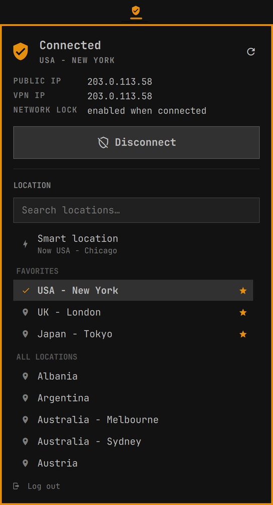

# ExpressVPN for Omarchy

An Omarchy shell plugin that runs ExpressVPN headlessly from the bar. You get a
shield icon that shows the connection state, plus a small panel to connect,
disconnect, pick a location and log in. The ExpressVPN GUI is not needed.



## What it does

- **Bar icon.** A shield that changes with the state:

  | State | Look |
  |:--|:--|
  | Connected | Accent color, with a check |
  | Connecting or reconnecting | Pulses |
  | Disconnected | Dimmed |
  | Interrupted | Warning color |
  | Logged out | Warning color, with a key |
  | Daemon not answering | Warning color, with an X |

  Hover for the state, location and IP. Left click opens the panel and middle
  click refreshes.
- **Panel.**
  - The current state and location, plus the public IP, VPN IP and Network Lock setting.
  - A Connect / Disconnect button.
  - A location picker:
    - Search across every location.
    - Smart location at the top, showing where it currently points.
    - Starred favorites, then the full list.
    - Picking a location while connected reconnects there. While disconnected, it just becomes the location for the next connect.
- **Login.** When the daemon reports that no one is logged in, the panel shows
  an activation-code field instead of the location list. A small **Log out**
  link, with a confirmation step, sits at the bottom of the panel.
- **Never auto-connects.** The widget only reads state when it loads and on its
  timers. It connects only when you click Connect, or pick a new location while
  already connected. It does not touch ExpressVPN's own `autoconnect` setting.

## Requirements

- Omarchy with the Quickshell-based `omarchy-shell`.
- The ExpressVPN Linux client, version 5.0.1 or later, which ships
  `expressvpnctl`. The widget calls `/usr/bin/expressvpnctl`.
- The daemon running at boot:

  ```sh
  sudo systemctl enable --now expressvpn-service
  ```

- Background mode, so `expressvpnctl` works without the GUI running:

  ```sh
  expressvpnctl background enable
  ```

## Install

```sh
omarchy plugin add https://github.com/supercleanse/omarchy-expressvpn --enable
```

This adds the `supercleanse.expressvpn` widget to your bar. Use
`omarchy bar move supercleanse.expressvpn --section right` (or edit
`~/.config/omarchy/shell.json`) to place it. Update later with
`omarchy plugin update supercleanse.expressvpn`. If a hot reload keeps showing
the old version, run `omarchy restart shell`.

Favorites are stored in `~/.config/supercleanse-expressvpn/config.json`.

## IPC and keybinding

```sh
omarchy-shell supercleanse.expressvpn toggle    # open or close the panel
omarchy-shell supercleanse.expressvpn open
omarchy-shell supercleanse.expressvpn close
omarchy-shell supercleanse.expressvpn refresh   # re-read state now
omarchy-shell supercleanse.expressvpn status    # prints e.g. "Disconnected"
```

The panel opens on the focused monitor. To bind it to a key, add this to
`~/.config/hypr/bindings.lua`:

```lua
o.bind("SUPER + SHIFT + V", "ExpressVPN", "omarchy-shell supercleanse.expressvpn toggle")
```

In the panel, the arrow keys move through the location list and Enter picks the
highlighted row. Enter does nothing until you have moved to a row, so stray
typing can't switch locations. Escape closes the panel.

## How it works

- Live state comes from a long-running `expressvpnctl monitor connectionstate`.
  If it exits, it restarts with backoff.
- A light `status` poll catches two cases:
  - A logged-out account.
  - A daemon that isn't answering. One-shot commands time out when the daemon is down, while the monitor just waits silently.
- Region, smart location and IP addresses are re-read after each state change
  and once a minute.
- Every call passes a timeout. Nothing runs with elevated privileges.

## Login security

`expressvpnctl login` only accepts credentials from a file. The panel handles
the activation code like this:

1. The code goes to `login.sh` over stdin. It never appears on a command line,
   in the environment, or in a log.
2. `login.sh` writes it to a `mktemp` file under `$XDG_RUNTIME_DIR` (a per-user
   tmpfs) with mode 600.
3. It runs `expressvpnctl login <file>` and deletes the file the moment login
   returns, or on any signal.
4. The code is never saved.

## Development

Clone the repo anywhere, then install your working copy into the shell:

```sh
dev/dev-install.sh
```

The shell caches compiled QML by file URL, so editing an installed file in
place (or copying over it) can leave the old code running. `dev-install.sh`
copies the plugin into a fresh `runtime-<stamp>/` folder under
`~/.config/omarchy/plugins/supercleanse.expressvpn/`, points the installed
manifest at it, and removes the old folder, so each run is a real reload. Run
it after every change. The repository itself stays a plain plugin that
`omarchy plugin add` can clone. Remove any git-installed copy first
(`omarchy plugin remove supercleanse.expressvpn`).

Validate before committing:

```sh
omarchy plugin validate .
```

**Testing without touching your VPN.** `dev/fake-expressvpnctl.sh` stands in
for `expressvpnctl` and refuses every command that would change anything. Point
the widget at it with the **dev-only** `ctlPath` setting on the bar entry in
`~/.config/omarchy/shell.json`:

```json
{ "id": "supercleanse.expressvpn", "ctlPath": "/path/to/omarchy-expressvpn/dev/fake-expressvpnctl.sh" }
```

Then choose a state with:

```sh
echo connected > "$XDG_RUNTIME_DIR/supercleanse-expressvpn-fake-mode"
```

The modes are `connected`, `disconnected`, `connecting`, `interrupted`, `logout`
and `down`. After changing the mode, run
`omarchy-shell supercleanse.expressvpn refresh`. Remove `ctlPath` when you're
done.

Watch for QML errors with:

```sh
journalctl --user -f | grep -i expressvpn
```

## License

MIT
